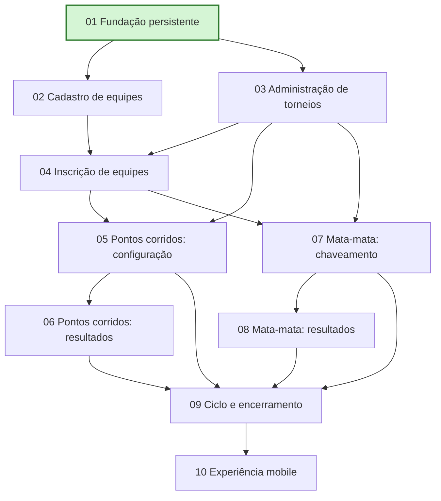

# DAG das dependências

```mermaid
graph TD
    I01["01 Fundação persistente"]
    I02["02 Cadastro de equipes"]
    I03["03 Administração de torneios"]
    I04["04 Inscrição de equipes"]
    I05["05 Pontos corridos: configuração"]
    I06["06 Pontos corridos: resultados"]
    I07["07 Mata-mata: chaveamento"]
    I08["08 Mata-mata: resultados"]
    I09["09 Ciclo e encerramento"]
    I10["10 Experiência mobile"]

    I01 --> I02
    I01 --> I03
    I02 --> I04
    I03 --> I04
    I03 --> I05
    I04 --> I05
    I05 --> I06
    I03 --> I07
    I04 --> I07
    I07 --> I08
    I05 --> I09
    I06 --> I09
    I07 --> I09
    I08 --> I09
    I09 --> I10

    classDef frontier fill:#d5f5d5,stroke:#2d7a2d,stroke-width:2px
    class I01 frontier
```
